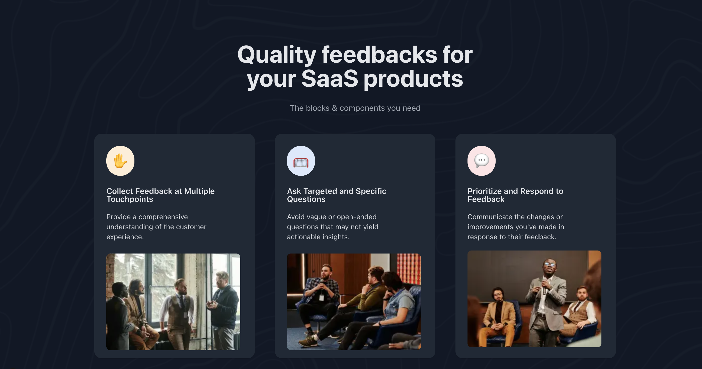

# 📌 Feature Section Challenge

Ce projet est un défi de **devchallenges.io**, qui consiste à coder une **section de fonctionnalités** en utilisant **Next.js, Tailwind CSS et ShadCN/UI**.

---

## 🚀 Objectifs

- Structurer et styliser une **section de fonctionnalités** propre et efficace
- Assurer une mise en page **responsive**
- Travailler avec **Next.js** et **ShadCN/UI** pour créer des composants réutilisables

---

## ✨ Fonctionnalités

✔️ **Utilisation de Flexbox et Flexbox imbriqués** pour la mise en page  
✔️ Chaque **carte** comprend :
  - ✅ Un **emoji**  
  - ✅ Un **titre**  
  - ✅ Une **description**  
  
✔️ Affichage en **trois colonnes** sur grand écran  
✔️ Passage en **colonne unique** sur mobile  
✔️ **Design propre** avec espacement et typographie optimisés  

---

## 🖥️ Technologies utilisées

- ⚡ **Next.js** - Framework React  
- 🎨 **Tailwind CSS** - Pour le style et le responsive  
- 🏗️ **ShadCN/UI** - Bibliothèque de composants UI  

---

## 📂 Structure du projet

├── public/
│   ├── resources/
│   │   ├── photo_1.png
│   │   ├── photo_2.png
│   │   ├── photo_3.png
├── components/
│   ├── ui-custom/ (si applicable)
│   ├── FeatureCard.tsx
│   ├── FeatureSection.tsx
├── app/
│   ├── page.tsx
│   ├── layout.tsx
├── styles/
│   ├── globals.css
│   ├── feature-section.css (si applicable)
├── README.md

🏗️ Installation et exécution

# Cloner le projet

git clone https://github.com/ton-utilisateur/ton-repo.git
cd ton-repo

Installer les dépendances

```npm install```

# Lancer le projet

npm run dev

Ouvrir dans le navigateur

Rendez-vous sur http://localhost:3000 pour voir le projet en action.

# 📱 Responsive Design

Grand écran : Les cartes sont affichées en trois colonnes

Écran mobile : Les cartes sont empilées verticalement

Espacements et alignements optimisés pour une meilleure lisibilité

🎨 Aperçu



# 📜 Licence

Ce projet est sous licence MIT.